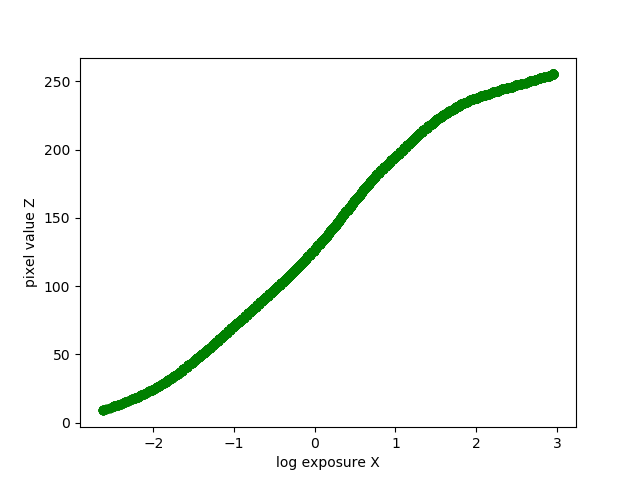
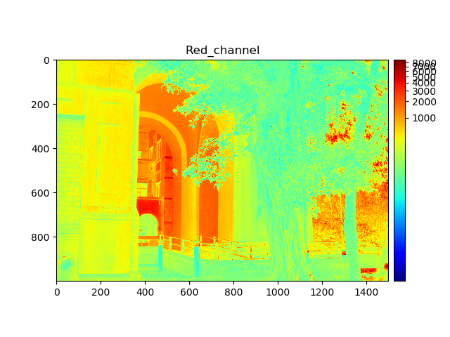
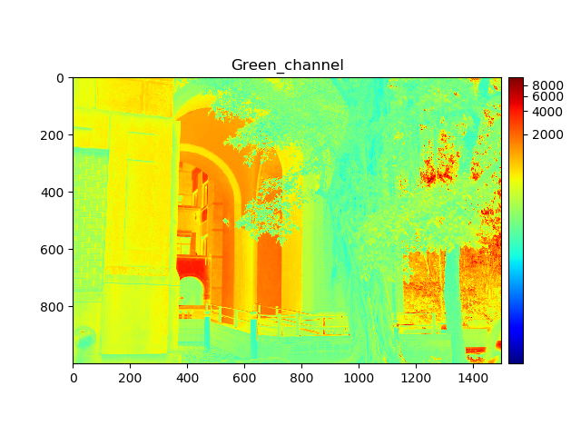

# VFX HW1

### Installation

~~~~
pip install -r requirements.txt
~~~~

### Execution

~~~~
# Reinhard 2005
python main.py --annofile exp/ex_2/task2_ss_ex2.txt --imgfolder exp/ex_2 --outfolder anyway --tone_method "Reinhard2005"

# Reinhard 2002 (Global Operator)
python main.py --annofile exp/ex_2/task2_ss_ex2.txt --imgfolder exp/ex_2 --outfolder anyway --tone_method "Reinhard2002Global"

# Reinhard 2002 (Local Operator)
python main.py --annofile exp/ex_2/task2_ss_ex2.txt --imgfolder exp/ex_2 --outfolder anyway --tone_method "Reinhard2002Local"

# support MTB
python main.py --annofile exp/ex_2/task2_ss_ex2.txt --imgfolder exp/ex_2 --outfolder anyway --tone_method "Reinhard2002Local" --MTB

# To learn more, please use the following commands
python main.py --help
~~~~

### Experiment

##### For Windows

~~~~
run.bat
~~~~

##### For Linux, OSX

~~~~
bash run.sh
~~~~

##### MTB Results

###### INPUT

###### OUTPUT

##### HDR

| Red        | Green           | Blue  |
| ---------- |:---------------:| -----:|
|       |  |  |
|       |       |    |

Note. To view the assembled high dynamic range image, plase drag [*.hdr](result/ex_2/HDR.exr) file to this [website](https://viewer.openhdr.org/).

##### Tone Reproduction

|        | Input         | Reinhard2002  | Reinhard2005  |
| ------ | ------------- |:-------------:| -------------:|
| Task 1 |      |  |  |     
| Task 2 |       |  |  |
| Task 3 |       |       |    |

### Reference

[1] G. Ward. Fast, robust image registration for compositing high dynamic range photographs from hand-held exposures.Journal of graphics tools, 8(2):17–30, 2003.

[2] P. DEBEVEC and J. MALIK. Recovering high dynamic range radiance maps from photographs.  In Computer graphics proceedings, annual conference series, pages 369–378. Association for Computing Machinery SIGGRAPH, 1997.

[3] E. Reinhard,  M. Stark,  P. Shirley,  and J. Ferwerda.   Photographic tone reproduction for digital images.  In Proceedings of the 29th annual conference on Computer graphics and interactive techniques, pages 267–276, 2002.

[4] E. Reinhard  and  K.  Devlin.   Dynamic  range  reduction  inspired by photoreceptor physiology. IEEE transactions on visualization and computer graphics, 11(1):13–24, 2005.

[5] R. Fattal, D. Lischinski, and M. Werman.   Gradient domain high  dynamic  range  compression. In Proceedings  of  the 29th annual conference on Computer graphics and interactive techniques, pages 249–256, 2002.
